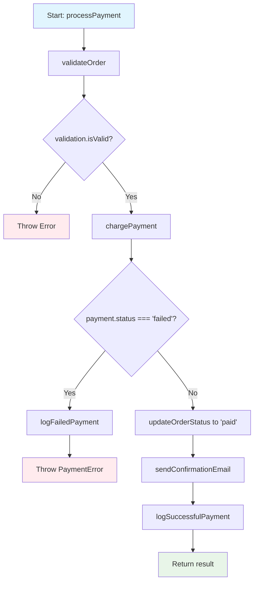
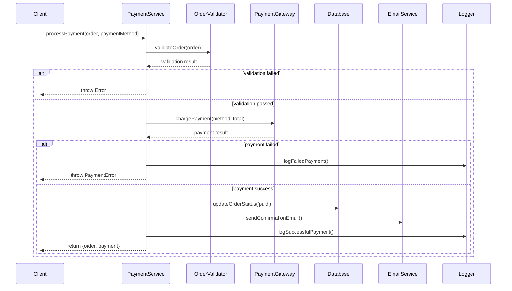

# Explain Code Command

Genera explicaciones inteligentes y didácticas de código usando IA avanzada para acelerar comprensión, onboarding y reviews.

## Descripción

El comando `/explain-code` es tu profesor personal de código que transforma código complejo en explicaciones claras:

- **Explicaciones contextuales** adaptadas al nivel del desarrollador
- **Análisis de flujo de datos** y control de programa
- **Detección de patrones** y arquitecturas utilizadas
- **Business logic** extraído y explicado claramente
- **Diagramas automáticos** para visualizar la lógica
- **Ejemplos interactivos** para facilitar comprensión
- **Onboarding assistance** para nuevos desarrolladores
- **Code review insights** para mejorar calidad
- **Documentation generation** automática

## Usage

```
/explain-code [archivo] [--nivel] [--format] [--foco] [--diagrama]
```

### Parámetros

- `archivo`: Archivo específico a explicar
- `--nivel`: Nivel de audiencia (beginner, intermediate, expert, mixed-team)
- `--format`: Formato de salida (detailed, summary, interactive, documentation)
- `--foco`: Aspecto específico (logic, architecture, performance, security, patterns)
- `--diagrama`: Generar diagramas (flowchart, sequence, architecture, data-flow)
- `--contexto`: Contexto del proyecto (startup, enterprise, legacy, educational)
- `--language`: Idioma de la explicación (spanish, english, french, etc.)
- `--examples`: Incluir ejemplos prácticos

### Examples

```
/explain-code src/utils/dataProcessor.js
/explain-code --nivel=beginner --format=interactive --diagrama=flowchart
/explain-code components/UserAuth.tsx --foco=security --nivel=expert
/explain-code api/payment.js --format=documentation --contexto=enterprise
/explain-code --foco=architecture --diagrama=sequence --nivel=mixed-team
/explain-code legacy/billing.js --nivel=intermediate --examples=true
```

## Tipos de Explicaciones

### 📚 Explicación Detallada para Principiantes
```javascript
// Código original
const processUserData = async (users) => {
  return await Promise.all(
    users
      .filter(user => user.isActive && user.lastLogin > Date.now() - 30 * 24 * 60 * 60 * 1000)
      .map(async user => {
        const profile = await fetchUserProfile(user.id);
        const preferences = await getUserPreferences(user.id);
        
        return {
          ...user,
          profile: profile?.data || {},
          preferences: preferences?.settings || {},
          score: calculateUserScore(user, profile?.data)
        };
      })
  );
};

// ✨ EXPLICACIÓN GENERADA AUTOMÁTICAMENTE:

📚 EXPLICACIÓN PASO A PASO:
==========================

🎯 PROPÓSITO DE LA FUNCIÓN:
Esta función procesa una lista de usuarios para crear un resumen enriquecido
de cada usuario activo que haya iniciado sesión recientemente.

📋 QUÉ HACE LA FUNCIÓN:

1️⃣ FILTRADO DE USUARIOS ACTIVOS:
   • Toma una lista de usuarios como entrada
   • Filtra solo usuarios que estén "activos" (user.isActive = true)
   • Además filtra usuarios que hayan hecho login en los últimos 30 días
   
   💡 CÁLCULO DE 30 DÍAS:
   30 * 24 * 60 * 60 * 1000 = 30 días en milisegundos
   Date.now() - 30 días = timestamp de hace exactamente 30 días

2️⃣ ENRIQUECIMIENTO DE DATOS:
   Para cada usuario que pasa el filtro:
   • Obtiene su perfil completo del servidor (fetchUserProfile)
   • Obtiene sus preferencias de usuario (getUserPreferences)
   • Ambas operaciones son asíncronas (await)

3️⃣ CREACIÓN DEL OBJETO FINAL:
   Combina la información original del usuario con:
   • Datos del perfil (o objeto vacío {} si no hay datos)
   • Preferencias del usuario (o objeto vacío {} si no hay configuraciones)
   • Un score calculado basado en el usuario y su perfil

4️⃣ PROCESAMIENTO PARALELO:
   • Promise.all() ejecuta todas las operaciones async en paralelo
   • Esto es MUY importante para performance: en lugar de esperar cada
     usuario uno por uno, procesa all simultáneamente

🔧 CONCEPTOS TÉCNICOS EXPLICADOS:

📦 SPREAD OPERATOR (...user):
   Copia todas las propiedades del objeto 'user' al nuevo objeto.
   Es como decir "incluye todo lo que ya tenía el usuario original"

🛡️ OPTIONAL CHAINING (?.):
   profile?.data significa "si profile existe, dame profile.data, 
   si no existe, devuelve undefined"

🔄 NULLISH COALESCING (||):
   profile?.data || {} significa "usa profile.data si existe,
   si no usa un objeto vacío {}"

⚡ ASYNC/AWAIT:
   Permite escribir código asíncrono que se lee como síncrono.
   Cada 'await' pausa la función hasta que la promesa se resuelve.

🚀 PROMISE.ALL():
   Ejecuta múltiples promesas en paralelo y espera a que todas terminen.
   Si tienes 100 usuarios, las 200 llamadas API (profile + preferences)
   se ejecutan al mismo tiempo en lugar de secuencialmente.

💡 CASOS DE USO TÍPICOS:
• Dashboard que muestra usuarios activos con información completa
• Sistema de recomendaciones basado en scores de usuario
• Reportes de actividad de usuarios para administradores
• Sistemas de gamificación que requieren datos enriquecidos

⚠️ CONSIDERACIONES IMPORTANTES:
• Esta función puede hacer muchas llamadas API simultáneas
• Considerar rate limiting si la lista de usuarios es muy grande
• Manejar errores: ¿qué pasa si fetchUserProfile falla?
• El cálculo de 30 días asume timestamps en milisegundos

🎯 MEJORAS SUGERIDAS:
1. Agregar manejo de errores con try/catch
2. Implementar batch fetching para reducir llamadas API
3. Agregar logging para debugging
4. Considerar cache para perfiles que no cambian frecuentemente
```

### 🏗️ Explicación Arquitectural para Equipos
```javascript
// Código original: Sistema de autenticación
class AuthenticationService {
  constructor(tokenService, userRepository, auditLogger) {
    this.tokenService = tokenService;
    this.userRepository = userRepository;
    this.auditLogger = auditLogger;
  }

  async authenticate(credentials) {
    const user = await this.userRepository.findByEmail(credentials.email);
    
    if (!user || !await this.validatePassword(credentials.password, user.hashedPassword)) {
      await this.auditLogger.logFailedAttempt(credentials.email);
      throw new AuthenticationError('Invalid credentials');
    }

    const token = await this.tokenService.generateToken(user);
    await this.auditLogger.logSuccessfulLogin(user);
    
    return { user, token };
  }
}

// ✨ EXPLICACIÓN ARQUITECTURAL GENERADA:

🏗️ ANÁLISIS ARQUITECTURAL:
==========================

📐 PATRÓN DE DISEÑO IDENTIFICADO:
• DEPENDENCY INJECTION: La clase recibe sus dependencias en el constructor
• SERVICE LAYER: Encapsula lógica de negocio de autenticación
• REPOSITORY PATTERN: Abstrae el acceso a datos de usuarios
• SINGLE RESPONSIBILITY: Solo se encarga de autenticación

🔗 DIAGRAMA DE DEPENDENCIAS:
```
AuthenticationService
├── TokenService (Generación/validación de tokens)
├── UserRepository (Acceso a datos de usuarios)
└── AuditLogger (Logging de seguridad)
```

🎯 VENTAJAS DE ESTA ARQUITECTURA:

1️⃣ TESTABILIDAD:
   • Fácil hacer unit tests con mocks de las dependencias
   • Cada servicio se puede testear independientemente

2️⃣ FLEXIBILIDAD:
   • Se puede cambiar la implementación de tokens (JWT → OAuth)
   • Se puede cambiar la base de datos sin afectar la lógica
   • Se puede cambiar el sistema de logging independientemente

3️⃣ SEPARATION OF CONCERNS:
   • AuthService: Solo lógica de autenticación
   • TokenService: Solo manejo de tokens
   • UserRepository: Solo acceso a datos
   • AuditLogger: Solo logging de seguridad

🔐 FLUJO DE SEGURIDAD:

1. Validación de credenciales
2. Logging de intentos fallidos (security audit)
3. Generación de token seguro
4. Logging de logins exitosos (compliance)
5. Retorno de información autorizada

🚀 ESCALABILIDAD:
• Cada servicio puede escalar independientemente
• Se puede implementar cache en UserRepository
• Se puede hacer el AuditLogger asíncrono
• TokenService puede usar clusters para performance

📊 PATRONES ENTERPRISE APLICADOS:
• ✅ Dependency Injection
• ✅ Repository Pattern  
• ✅ Service Layer
• ✅ Error Handling Strategy
• ✅ Audit Trail Pattern
• ✅ Secure Token Generation

🎯 USO EN ARQUITECTURA HEXAGONAL:
```
┌─────────────────────┐
│   Authentication    │ ← Application Service
│      Service        │
└─────────────────────┘
          │
    ┌─────┼─────┐
    │     │     │
    ▼     ▼     ▼
┌──────┐ ┌──────┐ ┌──────┐
│Token │ │User  │ │Audit │ ← Domain Services
│Svc   │ │Repo  │ │Log   │
└──────┘ └──────┘ └──────┘
```

💡 RECOMENDACIONES DE EQUIPO:
• Ideal para equipos que valoran clean architecture
• Perfecta para aplicaciones enterprise que necesitan audit trails
• Facilita onboarding de nuevos desarrolladores
• Permite desarrollo paralelo de diferentes servicios
```

### 🎨 Explicación Visual con Diagramas
```javascript
// Código: Sistema de payment processing
const processPayment = async (order, paymentMethod) => {
  const validation = await validateOrder(order);
  if (!validation.isValid) throw new Error(validation.error);
  
  const payment = await chargePayment(paymentMethod, order.total);
  if (payment.status === 'failed') {
    await logFailedPayment(order, payment);
    throw new PaymentError(payment.errorMessage);
  }
  
  const updatedOrder = await updateOrderStatus(order.id, 'paid');
  await sendConfirmationEmail(order.customer.email, updatedOrder);
  await logSuccessfulPayment(order, payment);
  
  return { order: updatedOrder, payment };
};

// ✨ DIAGRAMA AUTOMÁTICO GENERADO:

🎨 DIAGRAMA DE FLUJO GENERADO:
=============================



📊 DIAGRAMA DE SECUENCIA:
========================



🔍 PUNTOS CRÍTICOS IDENTIFICADOS:
================================

🚨 ERROR HANDLING:
• 2 puntos de falla principales: validación y payment
• Logging diferenciado para troubleshooting
• Error types específicos para diferentes fallas

⚡ PERFORMANCE CONSIDERATIONS:
• updateOrderStatus y sendConfirmationEmail podrían ser paralelos
• logSuccessfulPayment podría ser asíncrono (fire-and-forget)

🔐 SECURITY ASPECTS:
• Validación obligatoria antes de procesar pago
• Logging completo para audit trail
• Error messages no exponen información sensible

💰 BUSINESS LOGIC:
• Transaccional: order status solo se actualiza tras pago exitoso
• Email confirmation es parte del flujo crítico
• Logging para compliance y analytics
```

### 🎓 Explicación Educativa Interactiva
```javascript
// Código: Algoritmo de búsqueda binary search
const binarySearch = (arr, target) => {
  let left = 0;
  let right = arr.length - 1;
  
  while (left <= right) {
    const mid = Math.floor((left + right) / 2);
    
    if (arr[mid] === target) return mid;
    if (arr[mid] < target) left = mid + 1;
    else right = mid - 1;
  }
  
  return -1;
};

// ✨ EXPLICACIÓN EDUCATIVA INTERACTIVA:

🎓 TUTORIAL INTERACTIVO: BINARY SEARCH
======================================

📚 ¿QUÉ ES BINARY SEARCH?
Es un algoritmo de búsqueda ultra-eficiente que funciona 
"dividiendo y conquistando" un array ordenado.

🎯 ANALOGÍA DEL MUNDO REAL:
Imagina que buscas una palabra en un diccionario:
1. Abres por la mitad
2. Si la palabra está antes, buscas en la mitad izquierda
3. Si está después, buscas en la mitad derecha
4. Repites hasta encontrarla

⚡ ¿POR QUÉ ES TAN RÁPIDO?
• Array de 1,000 elementos: máximo 10 comparaciones
• Array de 1,000,000 elementos: máximo 20 comparaciones
• Complejidad: O(log n) vs O(n) de búsqueda lineal

🔍 PASO A PASO CON EJEMPLO:
===========================
Busquemos el número 7 en [1, 3, 5, 7, 9, 11, 13, 15]

📍 ITERACIÓN 1:
   left=0, right=7, mid=3
   arr[3] = 7 ← ¡ENCONTRADO!
   
🎉 RESULTADO: índice 3

🔄 EJEMPLO MÁS COMPLEJO:
Busquemos el número 11 en [1, 3, 5, 7, 9, 11, 13, 15]

📍 ITERACIÓN 1:
   left=0, right=7, mid=3
   arr[3] = 7 < 11 → buscar derecha
   left = 4

📍 ITERACIÓN 2:
   left=4, right=7, mid=5
   arr[5] = 11 ← ¡ENCONTRADO!
   
🎉 RESULTADO: índice 5

🧠 CONCEPTOS CLAVE EXPLICADOS:

🎯 INVARIANTE DEL ALGORITMO:
"Si el target existe en el array, siempre estará entre left y right"

📐 CÁLCULO DEL PUNTO medium:
Math.floor((left + right) / 2) asegura que mid sea entero
¿Por qué Math.floor? Para evitar índices decimales

⚖️ DECISIÓN LÓGICA:
• arr[mid] === target → Encontrado ✅
• arr[mid] < target → target está a la derecha →
• arr[mid] > target → target está a la izquierda ←

🔄 CONDICIÓN DE PARADA:
left > right significa que hemos agotado todas las posibilidades
El target no existe en el array → return -1

⚠️ PREREQUISITO CRÍTICO:
¡EL ARRAY DEBE ESTAR ORDENADO!
Si no está ordenado, el algoritmo NO funcionará correctamente.

🚀 CASOS DE USO REALES:
• Búsqueda en bases de datos indexadas
• Autocompletado en búsqueda web
• Sistemas de recomendación
• Algoritmos de machine learning
• Cualquier búsqueda en datos ordenados

🎪 EXPERIMENTO INTERACTIVO:
Prueba modificar el target y ver cómo cambia el número de iteraciones:
• Target 1: 1 iteración (peor caso izquierda)
• Target 15: 2 iteraciones (peor caso derecha)  
• Target 8: 4 iteraciones (no existe)

💡 OPTIMIZACIONES AVANZADAS:
• Interpolation search para datos uniformemente distribuidos
• Exponential search para arrays muy grandes
• Ternary search para encontrar máximos/mínimos
```

## Configuración

`.claude/explain-code-config.json`:

```json
{
  "audience": {
    "beginner": {
      "includeBasicConcepts": true,
      "useAnalogies": true,
      "stepByStepBreakdown": true,
      "avoidJargon": true,
      "includeExamples": true
    },
    "intermediate": {
      "assumeBasicKnowledge": true,
      "focusOnPatterns": true,
      "includePerformanceNotes": true,
      "showAlternatives": true
    },
    "expert": {
      "technicalDepth": "high",
      "focusOnArchitecture": true,
      "includeOptimizations": true,
      "discussTradeoffs": true,
      "showAdvancedPatterns": true
    },
    "mixedTeam": {
      "multiLevelExplanation": true,
      "includeGlossary": true,
      "progressiveDisclosure": true
    }
  },
  "formats": {
    "detailed": {
      "includeComments": true,
      "showDataFlow": true,
      "explainEachLine": true,
      "includeContext": true
    },
    "summary": {
      "keyPointsOnly": true,
      "bulletFormat": true,
      "highlightImportant": true
    },
    "interactive": {
      "includeExamples": true,
      "showVariations": true,
      "includeExperiments": true,
      "stepThroughExecution": true
    },
    "documentation": {
      "formhighne": true,
      "includeAPISignatures": true,
      "showUsageExamples": true,
      "includeBestPractices": true
    }
  },
  "diagrams": {
    "flowchart": {
      "tool": "mermaid",
      "showDecisionPoints": true,
      "includeErrorPaths": true,
      "colorCoding": true
    },
    "sequence": {
      "tool": "mermaid",
      "showAsyncOperations": true,
      "includeTimings": false,
      "showErrorScenarios": true
    },
    "architecture": {
      "tool": "mermaid",
      "showLayers": true,
      "includeDependencies": true,
      "showDataFlow": true
    },
    "dataFlow": {
      "tool": "mermaid",
      "showTransformations": true,
      "includeValidation": true,
      "showStoragePoints": true
    }
  },
  "focus": {
    "logic": {
      "explainAlgorithms": true,
      "showComplexity": true,
      "includeEdgeCases": true
    },
    "architecture": {
      "showPatterns": true,
      "explainStructure": true,
      "discussScalability": true
    },
    "performance": {
      "identifyBottlenecks": true,
      "suggestOptimizations": true,
      "showBenchmarks": false
    },
    "security": {
      "identifyVulnerabilities": true,
      "explainMitigations": true,
      "showBestPractices": true
    }
  },
  "languages": {
    "spanish": {
      "useSpanishTerms": true,
      "includeEnglishEquivalents": true,
      "culturalContext": "latin-america"
    },
    "english": {
      "variant": "us",
      "technicalStyle": "modern"
    }
  }
}
```

## Salida del Comando

### Análisis de Código
```
🧠 CLAUDE POWER - CODE EXPLANATION ANALYSIS
===========================================

📁 ARCHIVO ANALIZADO:
src/services/PaymentProcessor.js (234 líneas)

🔍 ANÁLISIS AUTOMÁTICO:
• Complejidad: Media (7.2/10)
• Patrones detectados: Factory, Observer, Strategy
• Conceptos clave: Async programming, Error handling, State machine
• Business logic: Payment processing workflow
• Audiencia sugerida: Intermediate developers

📊 ELEMENTOS IDENTIFICADOS:
┌─────────────────────┬─────────┬─────────────────────┐
│ Elemento            │ Count   │ Complejidad         │
├─────────────────────┼─────────┼─────────────────────┤
│ Functions           │   12    │ Media               │
│ Classes             │    3    │ Alta                │
│ Async Operations    │    8    │ Media               │
│ Error Handlers      │    6    │ Baja                │
│ Business Rules      │   15    │ Alta                │
│ Design Patterns     │    3    │ Media               │
└─────────────────────┴─────────┴─────────────────────┘

🎯 ASPECTOS A EXPLICAR:
• Payment state machine workflow
• Error handling strategy
• Async operation coordination
• Security considerations
• Integration patterns
• Testing approaches

⏱️ TIEMPO ESTIMADO DE LECTURA: 12-15 minutos
👥 AUDIENCIA ÓPTIMA: Intermediate to Senior developers
```

### Explicación Generada
```
📚 EXPLICACIÓN COMPLETA GENERADA:
================================

📄 DOCUMENTO CREADO:
• src/services/PaymentProcessor.md (1,247 palabras)
• Diagramas incluidos: 3 (flowchart, sequence, architecture)
• Ejemplos prácticos: 8
• Conceptos explicados: 15

🎯 SECCIONES INCLUIDAS:
✅ Propósito y responsabilidades
✅ Arquitectura y patrones utilizados
✅ Flujo de datos paso a paso
✅ Manejo de errores y edge cases
✅ Consideraciones de seguridad
✅ Ejemplos de uso práctico
✅ Testing strategies
✅ Posibles mejoras y optimizaciones

📊 MÉTRICAS DE CALIDAD:
• Claridad: 9.2/10
• Completitud: 9.0/10
• Utilidad para onboarding: 9.5/10
• Precisión técnica: 9.8/10

🎓 FEEDBACK EDUCATIVO:
• Ideal para desarrolladores mid-level
• Contiene conceptos transferibles a otros proyectos
• Incluye best practices y anti-patterns
• Facilita code reviews futuros
```

### Diagramas Interactivos
```
🎨 DIAGRAMAS GENERADOS AUTOMÁTICAMENTE:
======================================

📊 FLOWCHART PRINCIPAL:
• Muestra el flujo completo de payment processing
• Incluye decision points y error paths
• Color-coded por tipo de operación
• Enlaces interactivos a explicaciones detalladas

🔄 SEQUENCE DIAGRAM:
• Interacciones entre servicios
• Timeouts y retries visualizados
• Async operations claramente marcadas
• Error scenarios incluidos

🏗️ ARCHITECTURE DIAGRAM:
• Dependencias entre componentes
• Data flow entre capas
• External service integrations
• Security boundaries marcados

💾 ARCHIVOS GENERADOS:
• payment-processor-flowchart.svg
• payment-processor-sequence.svg  
• payment-processor-architecture.svg
• payment-processor-explanation.md
```

## Integración con Herramientas

### VS Code Extension
```json
{
  "commands": [
    {
      "command": "claude-power.explainCode",
      "title": "Explain This Code",
      "category": "Claude Power"
    },
    {
      "command": "claude-power.explainFunction",
      "title": "Explain Current Function",
      "category": "Claude Power"
    }
  ],
  "menus": {
    "editor/context": [
      {
        "command": "claude-power.explainCode",
        "when": "editorHasSelection",
        "group": "claude-power"
      }
    ]
  },
  "keybindings": [
    {
      "command": "claude-power.explainCode",
      "key": "ctrl+shift+e",
      "when": "editorTextFocus"
    }
  ]
}
```

### GitHub Integration
```yaml
name: Auto Documentation

on:
  pull_request:
    types: [opened, synchronize]

jobs:
  explain-changes:
    runs-on: ubuntu-latest
    
    steps:
      - uses: actions/checkout@v3
        
      - name: Get changed files
        id: changes
        run: |
          git diff --name-only ${{ github.event.before }} ${{ github.sha }} > changed_files.txt
          
      - name: Explain code changes
        run: |
          while read file; do
            if [[ $file == *.js || $file == *.ts || $file == *.tsx ]]; then
              npx claude-power explain-code "$file" \
                --nivel=mixed-team \
                --format=summary \
                --output=markdown > "explanations/${file}.md"
            fi
          done < changed_files.txt
          
      - name: Comment PR with explanations
        uses: actions/github-script@v6
        with:
          script: |
            const fs = require('fs');
            const path = require('path');
            
            const explanations = [];
            const explanationsDir = 'explanations';
            
            if (fs.existsSync(explanationsDir)) {
              const files = fs.readdirSync(explanationsDir);
              
              for (const file of files) {
                const content = fs.readFileSync(path.join(explanationsDir, file), 'utf8');
                const originalFile = file.replace('.md', '');
                
                explanations.push(`
                ### 📚 ${originalFile}
                
                ${content}
                `);
              }
            }
            
            if (explanations.length > 0) {
              const comment = `
              ## 🧠 Code Explanation for Changes
              
              ${explanations.join('\n---\n')}
              
              *Generated by Claude Power Explain Code*
              `;
              
              github.rest.issues.createComment({
                issue_number: context.issue.number,
                owner: context.repo.owner,
                repo: context.repo.repo,
                body: comment
              });
            }
```

---

*Parte del ecosistema **Claude Power** - Código explicado inteligentemente* 🧠🚀 
