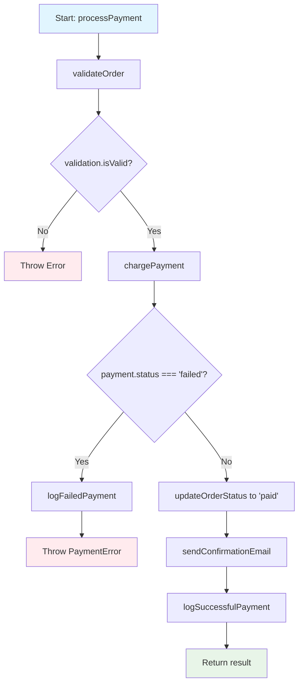
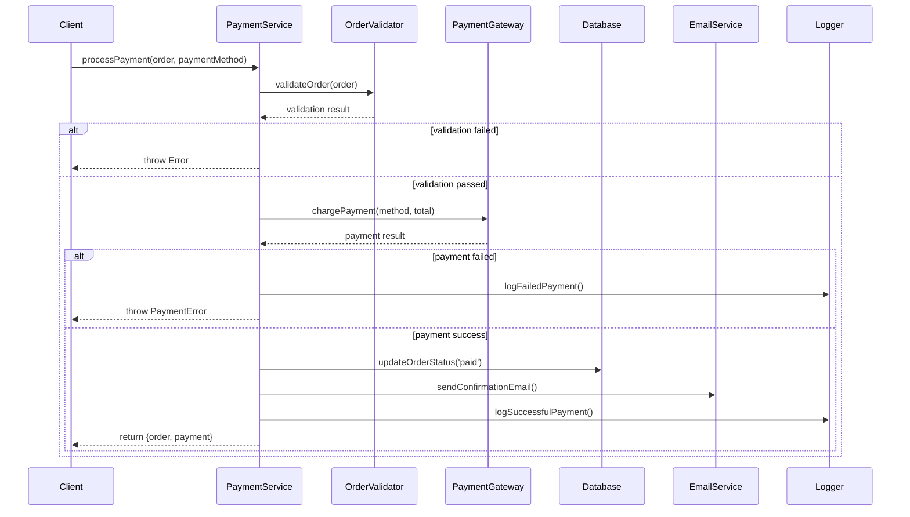

# Explain Code Command

Generates intelligent and didactic code explanations using advanced AI to accelerate understanding, onboarding, and reviews.

## Description

The `/explain-code` command is your personal code tutor that transforms complex code into clear explanations:

- **Contextual explanations** adapted to the developer's level
- **Data flow analysis** and program control
- **Detection of patterns** and architectures used
- **Business logic** extracted and clearly explained
- **Automatic diagrams** to visualize the logic
- **Interactive examples** to facilitate understanding
- **Onboarding assistance** for new developers
- **Code review insights** to improve quality
- **Automatic documentation generation**

## Usage

```
/explain-code [file] [--level] [--format] [--focus] [--diagram]
```

### Parameters

- `file`: Specific file to explain
- `--level`: Audience level (beginner, intermediate, expert, mixed-team)
- `--format`: Output format (detailed, summary, interactive, documentation)
- `--focus`: Specific aspect (logic, architecture, performance, security, patterns)
- `--diagram`: Generate diagrams (flowchart, sequence, architecture, data-flow)
- `--context`: Project context (startup, enterprise, legacy, educational)
- `--language`: Explanation language (spanish, english, french, etc.)
- `--examples`: Include practical examples

### Examples

```
/explain-code src/utils/dataProcessor.js
/explain-code --level=beginner --format=interactive --diagram=flowchart
/explain-code components/UserAuth.tsx --focus=security --level=expert
/explain-code api/payment.js --format=documentation --context=enterprise
/explain-code --focus=architecture --diagram=sequence --level=mixed-team
/explain-code legacy/billing.js --level=intermediate --examples=true
```

## Types of Explanations

### 📚 Detailed Explanation for Beginners
```javascript
// Original code
const processUserData = async (users) => {
  return await Promise.all(
    users
      .filter(user => user.isActive && user.lastLogin > Date.now() - 30 * 24 * 60 * 60 * 1000)
      .map(async user => {
        const profile = await fetchUserProfile(user.id);
        const preferences = await getUserPreferences(user.id);
        
        return {
          ...user,
          profile: profile?.data || {},
          preferences: preferences?.settings || {},
          score: calculateUserScore(user, profile?.data)
        };
      })
  );
};

// ✨ AUTOMATICALLY GENERATED EXPLANATION:

📚 STEP-BY-STEP EXPLANATION:
==========================

🎯 FUNCTION PURPOSE:
This function processes a list of users to create an enriched summary
for each active user who has recently logged in.

📋 WHAT THE FUNCTION DOES:

1️⃣ FILTERING ACTIVE USERS:
   • Takes a list of users as input
   • Filters only users who are "active" (user.isActive = true)
   • Additionally filters users who have logged in within the last 30 days
   
   💡 30-DAY CALCULATION:
   30 * 24 * 60 * 60 * 1000 = 30 days in milliseconds
   Date.now() - 30 days = timestamp from exactly 30 days ago

2️⃣ DATA ENRICHMENT:
   For each user that passes the filter:
   • Retrieves their complete profile from the server (fetchUserProfile)
   • Retrieves their user preferences (getUserPreferences)
   • Both operations are asynchronous (await)

3️⃣ CREATING THE FINAL OBJECT:
   Combines the original user information with:
   • Profile data (or an empty object {} if no data)
   • User preferences (or an empty object {} if no settings)
   • A calculated score based on the user and their profile

4️⃣ PARALLEL PROCESSING:
   • Promise.all() executes all async operations in parallel
   • This is VERY important for performance: instead of waiting for each
     user one by one, it processes all simultaneously

🔧 EXPLAINED TECHNICAL CONCEPTS:

📦 SPREAD OPERATOR (...user):
   Copies all properties from the 'user' object to the new object.
   It's like saying "include everything the original user already had"

🛡️ OPTIONAL CHAINING (?.):
   profile?.data means "if profile exists, give me profile.data, 
   otherwise, return undefined"

🔄 NULLISH COALESCING (||):
   profile?.data || {} means "use profile.data if it exists,
   otherwise use an empty object {}"

⚡ ASYNC/AWAIT:
   Allows writing asynchronous code that reads like synchronous code.
   Each 'await' pauses the function until the promise resolves.

🚀 PROMISE.ALL():
   Executes multiple promises in parallel and waits for all of them to complete.
   If you have 100 users, the 200 API calls (profile + preferences)
   are executed at the same time instead of sequentially.

💡 TYPICAL USE CASES:
• Dashboard showing active users with complete information
• Recommendation system based on user scores
• User activity reports for administrators
• Gamification systems requiring enriched data

⚠️ IMPORTANT CONSIDERATIONS:
• This function can make many simultaneous API calls
• Consider rate limiting if the user list is very large
• Handle errors: what happens if fetchUserProfile fails?
• The 30-day calculation assumes timestamps in milliseconds

🎯 SUGGESTED IMPROVEMENTS:
1. Add error handling with try/catch
2. Implement batch fetching to reduce API calls
3. Add logging for debugging
4. Consider caching for profiles that do not change frequently
```

### 🏗️ Architectural Explanation for Teams
```javascript
// Original code: Authentication system
class AuthenticationService {
  constructor(tokenService, userRepository, auditLogger) {
    this.tokenService = tokenService;
    this.userRepository = userRepository;
    this.auditLogger = auditLogger;
  }

  async authenticate(credentials) {
    const user = await this.userRepository.findByEmail(credentials.email);
    
    if (!user || !await this.validatePassword(credentials.password, user.hashedPassword)) {
      await this.auditLogger.logFailedAttempt(credentials.email);
      throw new AuthenticationError('Invalid credentials');
    }

    const token = await this.tokenService.generateToken(user);
    await this.auditLogger.logSuccessfulLogin(user);
    
    return { user, token };
  }
}

// ✨ GENERATED ARCHITECTURAL EXPLANATION:

🏗️ ARCHITECTURAL ANALYSIS:
==========================

📐 IDENTIFIED DESIGN PATTERNS:
• DEPENDENCY INJECTION: The class receives its dependencies in the constructor
• SERVICE LAYER: Encapsulates authentication business logic
• REPOSITORY PATTERN: Abstracts user data access
• SINGLE RESPONSIBILITY: Only handles authentication

🔗 DEPENDENCY DIAGRAM:
```
AuthenticationService
├── TokenService (Token generation/validation)
├── UserRepository (User data access)
└── AuditLogger (Security logging)
```

🎯 ADVANTAGES OF THIS ARCHITECTURE:

1️⃣ TESTABILITY:
   • Easy to unit test with mocks of dependencies
   • Each service can be tested independently

2️⃣ FLEXIBILITY:
   • Token implementation can be changed (JWT → OAuth)
   • Database can be changed without affecting logic
   • Logging system can be changed independently

3️⃣ SEPARATION OF CONCERNS:
   • AuthService: Only authentication logic
   • TokenService: Only token handling
   • UserRepository: Only data access
   • AuditLogger: Only security logging

🔐 SECURITY FLOW:

1. Credential validation
2. Logging of failed attempts (security audit)
3. Secure token generation
4. Logging of successful logins (compliance)
5. Return authorized information

🚀 SCALABILITY:
• Each service can scale independently
• Cache can be implemented in UserRepository
• AuditLogger can be made asynchronous
• TokenService can use clusters for performance

📊 APPLIED ENTERPRISE PATTERNS:
• ✅ Dependency Injection
• ✅ Repository Pattern  
• ✅ Service Layer
• ✅ Error Handling Strategy
• ✅ Audit Trail Pattern
• ✅ Secure Token Generation

🎯 USE IN HEXAGONAL ARCHITECTURE:
```
┌─────────────────────┐
│   Authentication    │ ← Application Service
│      Service        │
└─────────────────────┘
          │
    ┌─────┼─────┐
    │     │     │
    ▼     ▼     ▼
┌──────┐ ┌──────┐ ┌──────┐
│Token │ │User  │ │Audit │ ← Domain Services
│Svc   │ │Repo  │ │Log   │
└──────┘ └──────┘ └──────┘
```

💡 TEAM RECOMMENDATIONS:
• Ideal for teams that value clean architecture
• Perfect for enterprise applications that need audit trails
• Facilitates onboarding of new developers
• Allows parallel development of different services
```

### 🎨 Visual Explanation with Diagrams
```javascript
// Code: Payment processing system
const processPayment = async (order, paymentMethod) => {
  const validation = await validateOrder(order);
  if (!validation.isValid) throw new Error(validation.error);
  
  const payment = await chargePayment(paymentMethod, order.total);
  if (payment.status === 'failed') {
    await logFailedPayment(order, payment);
    throw new PaymentError(payment.errorMessage);
  }
  
  const updatedOrder = await updateOrderStatus(order.id, 'paid');
  await sendConfirmationEmail(order.customer.email, updatedOrder);
  await logSuccessfulPayment(order, payment);
  
  return { order: updatedOrder, payment };
};

// ✨ AUTOMATICALLY GENERATED DIAGRAM:

🎨 GENERATED FLOWCHART DIAGRAM:
=============================



📊 SEQUENCE DIAGRAM:
========================



🔍 IDENTIFIED CRITICAL POINTS:
================================

🚨 ERROR HANDLING:
• 2 main failure points: validation and payment
• Differentiated logging for troubleshooting
• Specific error types for different failures

⚡ PERFORMANCE CONSIDERATIONS:
• updateOrderStatus and sendConfirmationEmail could be parallel
• logSuccessfulPayment could be asynchronous (fire-and-forget)

🔐 SECURITY ASPECTS:
• Mandatory validation before processing payment
• Complete logging for audit trail
• Error messages do not expose sensitive information

💰 BUSINESS LOGIC:
• Transactional: order status only updates after successful payment
• Email confirmation is part of the critical flow
• Logging for compliance and analytics
```

### 🎓 Interactive Educational Explanation
```javascript
// Code: Binary search algorithm
const binarySearch = (arr, target) => {
  let left = 0;
  let right = arr.length - 1;
  
  while (left <= right) {
    const mid = Math.floor((left + right) / 2);
    
    if (arr[mid] === target) return mid;
    if (arr[mid] < target) left = mid + 1;
    else right = mid - 1;
  }
  
  return -1;
};

// ✨ INTERACTIVE EDUCATIONAL EXPLANATION:

🎓 INTERACTIVE TUTORIAL: BINARY SEARCH
======================================

📚 WHAT IS BINARY SEARCH?
It is an ultra-efficient search algorithm that works by
"dividing and conquering" a sorted array.

🎯 REAL-WORLD ANALOGY:
Imagine searching for a word in a dictionary:
1. Open to the middle
2. If the word is before, search the left half
3. If it's after, search the right half
4. Repeat until found

⚡ WHY IS IT SO FAST?
• 1,000-element array: maximum 10 comparisons
• 1,000,000-element array: maximum 20 comparisons
• Complexity: O(log n) vs O(n) for linear search

🔍 STEP-BY-STEP WITH EXAMPLE:
===========================
Let's search for the number 7 in [1, 3, 5, 7, 9, 11, 13, 15]

📍 ITERATION 1:
   left=0, right=7, mid=3
   arr[3] = 7 ← FOUND!
   
🎉 RESULT: index 3

🔄 MORE COMPLEX EXAMPLE:
Let's search for the number 11 in [1, 3, 5, 7, 9, 11, 13, 15]

📍 ITERATION 1:
   left=0, right=7, mid=3
   arr[3] = 7 < 11 → search right
   left = 4

📍 ITERATION 2:
   left=4, right=7, mid=5
   arr[5] = 11 ← FOUND!
   
🎉 RESULT: index 5

🧠 EXPLAINED KEY CONCEPTS:

🎯 ALGORITHM INVARIANT:
"If the target exists in the array, it will always be between left and right"

📐 MIDPOINT CALCULATION:
Math.floor((left + right) / 2) ensures mid is an integer
Why Math.floor? To avoid decimal indices

⚖️ LOGICAL DECISION:
• arr[mid] === target → Found ✅
• arr[mid] < target → target is to the right →
• arr[mid] > target → target is to the left ←

🔄 STOPPING CONDITION:
left > right means we have exhausted all possibilities
Target does not exist in the array → return -1

⚠️ CRITICAL PREREQUISITE:
THE ARRAY MUST BE SORTED!
If not sorted, the algorithm will NOT work correctly.

🚀 REAL USE CASES:
• Searching in indexed databases
• Autocomplete in web search
• Recommendation systems
• Machine learning algorithms
• Any search in sorted data

🎪 INTERACTIVE EXPERIMENT:
Try modifying the target and see how the number of iterations changes:
• Target 1: 1 iteration (worst case left)
• Target 15: 2 iterations (worst case right)  
• Target 8: 4 iterations (does not exist)

💡 ADVANCED OPTIMIZATIONS:
• Interpolation search for uniformly distributed data
• Exponential search for very large arrays
• Ternary search for finding max/min
```

## Configuration

`.claude/explain-code-config.json`:

```json
{
  "audience": {
    "beginner": {
      "includeBasicConcepts": true,
      "useAnalogies": true,
      "stepByStepBreakdown": true,
      "avoidJargon": true,
      "includeExamples": true
    },
    "intermediate": {
      "assumeBasicKnowledge": true,
      "focusOnPatterns": true,
      "includePerformanceNotes": true,
      "showAlternatives": true
    },
    "expert": {
      "technicalDepth": "high",
      "focusOnArchitecture": true,
      "includeOptimizations": true,
      "discussTradeoffs": true,
      "showAdvancedPatterns": true
    },
    "mixedTeam": {
      "multiLevelExplanation": true,
      "includeGlossary": true,
      "progressiveDisclosure": true
    }
  },
  "formats": {
    "detailed": {
      "includeComments": true,
      "showDataFlow": true,
      "explainEachLine": true,
      "includeContext": true
    },
    "summary": {
      "keyPointsOnly": true,
      "bulletFormat": true,
      "highlightImportant": true
    },
    "interactive": {
      "includeExamples": true,
      "showVariations": true,
      "includeExperiments": true,
      "stepThroughExecution": true
    },
    "documentation": {
      "formhighne": true,
      "includeAPISignatures": true,
      "showUsageExamples": true,
      "includeBestPractices": true
    }
  },
  "diagrams": {
    "flowchart": {
      "tool": "mermaid",
      "showDecisionPoints": true,
      "includeErrorPaths": true,
      "colorCoding": true
    },
    "sequence": {
      "tool": "mermaid",
      "showAsyncOperations": true,
      "includeTimings": false,
      "showErrorScenarios": true
    },
    "architecture": {
      "tool": "mermaid",
      "showLayers": true,
      "includeDependencies": true,
      "showDataFlow": true
    },
    "dataFlow": {
      "tool": "mermaid",
      "showTransformations": true,
      "includeValidation": true,
      "showStoragePoints": true
    }
  },
  "focus": {
    "logic": {
      "explainAlgorithms": true,
      "showComplexity": true,
      "includeEdgeCases": true
    },
    "architecture": {
      "showPatterns": true,
      "explainStructure": true,
      "discussScalability": true
    },
    "performance": {
      "identifyBottlenecks": true,
      "suggestOptimizations": true,
      "showBenchmarks": false
    },
    "security": {
      "identifyVulnerabilities": true,
      "explainMitigations": true,
      "showBestPractices": true
    }
  },
  "languages": {
    "spanish": {
      "useSpanishTerms": true,
      "includeEnglishEquivalents": true,
      "culturalContext": "latin-america"
    },
    "english": {
      "variant": "us",
      "technicalStyle": "modern"
    }
  }
}
```

## Command Output

### Code Analysis
```
🧠 CLAUDE POWER - CODE EXPLANATION ANALYSIS
===========================================

📁 ANALYZED FILE:
src/services/PaymentProcessor.js (234 lines)

🔍 AUTOMATIC ANALYSIS:
• Complexity: Medium (7.2/10)
• Detected patterns: Factory, Observer, Strategy
• Key concepts: Async programming, Error handling, State machine
• Business logic: Payment processing workflow
• Suggested audience: Intermediate developers

📊 IDENTIFIED ELEMENTS:
┌─────────────────────┬─────────┬─────────────────────┐
│ Element             │ Count   │ Complexity          │
├─────────────────────┼─────────┼─────────────────────┤
│ Functions           │   12    │ Medium              │
│ Classes             │    3    │ High                │
│ Async Operations    │    8    │ Medium              │
│ Error Handlers      │    6    │ Low                 │
│ Business Rules      │   15    │ High                │
│ Design Patterns     │    3    │ Medium              │
└─────────────────────┴─────────┴─────────────────────┘

🎯 ASPECTS TO EXPLAIN:
• Payment state machine workflow
• Error handling strategy
• Async operation coordination
• Security considerations
• Integration patterns
• Testing approaches

⏱️ ESTIMATED READING TIME: 12-15 minutes
👥 OPTIMAL AUDIENCE: Intermediate to Senior developers
```

### Generated Explanation
```
📚 COMPLETE EXPLANATION GENERATED:
================================

📄 DOCUMENT CREATED:
• src/services/PaymentProcessor.md (1,247 words)
• Diagrams included: 3 (flowchart, sequence, architecture)
• Practical examples: 8
• Concepts explained: 15

🎯 SECTIONS INCLUDED:
✅ Purpose and responsibilities
✅ Architecture and patterns used
✅ Step-by-step data flow
✅ Error handling and edge cases
✅ Security considerations
✅ Practical usage examples
✅ Testing strategies
✅ Possible improvements and optimizations

📊 QUALITY METRICS:
• Clarity: 9.2/10
• Completeness: 9.0/10
• Usefulness for onboarding: 9.5/10
• Technical accuracy: 9.8/10

🎓 EDUCATIONAL FEEDBACK:
• Ideal for mid-level developers
• Contains concepts transferable to other projects
• Includes best practices and anti-patterns
• Facilitates future code reviews
```

### Interactive Diagrams
```
🎨 AUTOMATICALLY GENERATED DIAGRAMS:
======================================

📊 MAIN FLOWCHART:
• Shows the complete payment processing flow
• Includes decision points and error paths
• Color-coded by operation type
• Interactive links to detailed explanations

🔄 SEQUENCE DIAGRAM:
• Interactions between services
• Timeouts and retries visualized
• Async operations clearly marked
• Error scenarios included

🏗️ ARCHITECTURE DIAGRAM:
• Dependencies between components
• Data flow between layers
• External service integrations
• Security boundaries marked

💾 GENERATED FILES:
• payment-processor-flowchart.svg
• payment-processor-sequence.svg  
• payment-processor-architecture.svg
• payment-processor-explanation.md
```

## Integrations with Tools

### VS Code Extension
```json
{
  "commands": [
    {
      "command": "claude-power.explainCode",
      "title": "Explain This Code",
      "category": "Claude Power"
    },
    {
      "command": "claude-power.explainFunction",
      "title": "Explain Current Function",
      "category": "Claude Power"
    }
  ],
  "menus": {
    "editor/context": [
      {
        "command": "claude-power.explainCode",
        "when": "editorHasSelection",
        "group": "claude-power"
      }
    ]
  },
  "keybindings": [
    {
      "command": "claude-power.explainCode",
      "key": "ctrl+shift+e",
      "when": "editorTextFocus"
    }
  ]
}
```

### GitHub Integration
```yaml
name: Auto Documentation

on:
  pull_request:
    types: [opened, synchronize]

jobs:
  explain-changes:
    runs-on: ubuntu-latest
    
    steps:
      - uses: actions/checkout@v3
        with:
          token: ${{ secrets.GITHUB_TOKEN }}
          
      - name: Get changed files
        id: changes
        run: |
          git diff --name-only ${{ github.event.before }} ${{ github.sha }} > changed_files.txt
          
      - name: Explain code changes
        run: |
          while read file; do
            if [[ $file == *.js || $file == *.ts || $file == *.tsx ]]; then
              npx claude-power explain-code "$file" \
                --level=mixed-team \
                --format=summary \
                --output=markdown > "explanations/${file}.md"
            fi
          done < changed_files.txt
          
      - name: Comment PR with explanations
        uses: actions/github-script@v6
        with:
          script: |
            const fs = require('fs');
            const path = require('path');
            
            const explanations = [];
            const explanationsDir = 'explanations';
            
            if (fs.existsSync(explanationsDir)) {
              const files = fs.readdirSync(explanationsDir);
              
              for (const file of files) {
                const content = fs.readFileSync(path.join(explanationsDir, file), 'utf8');
                const originalFile = file.replace('.md', '');
                
                explanations.push(`
                ### 📚 ${originalFile}
                
                ${content}
                `);
              }
            }
            
            if (explanations.length > 0) {
              const comment = `
              ## 🧠 Code Explanation for Changes
              
              ${explanations.join('\n---\n')}
              
              *Generated by Claude Power Explain Code*
              `;
              
              github.rest.issues.createComment({
                issue_number: context.issue.number,
                owner: context.repo.owner,
                repo: context.repo.repo,
                body: comment
              });
            }
```

---

*Part of the **Claude Power** ecosystem - Intelligently explained code* 🧠🚀 
