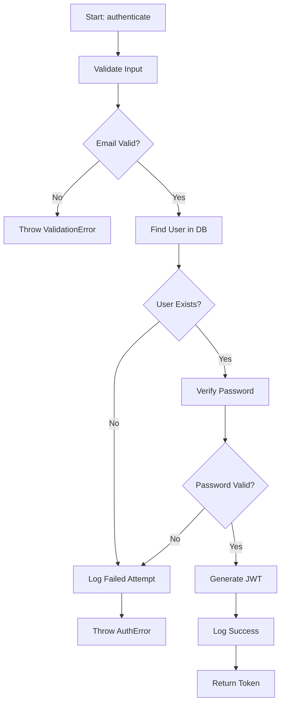
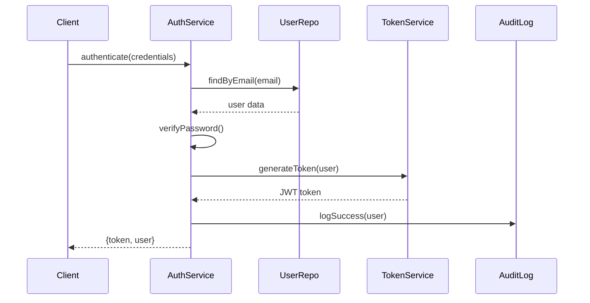
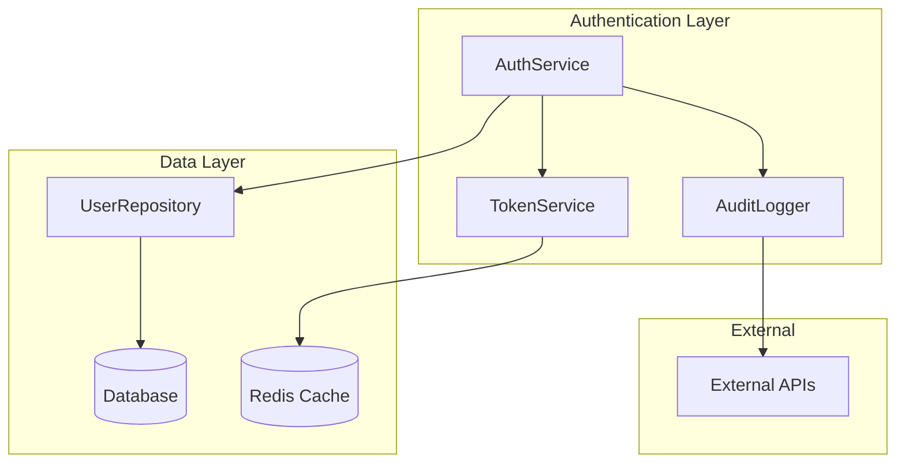

# Explain Code - Guía de Usuario

## Descripción

El comando `/explain-code` de Claude Power es tu profesor personal de código que transforma cualquier código complejo en explicaciones claras y didácticas, acelerando el onboarding, mejorando code reviews y facilitando el aprendizaje continuo.

## ¿Por qué usar Explain Code?

### 🧠 **Beneficios Inmediatos**
- **Acelera onboarding 80%** con explicaciones contextuales
- **Mejora code reviews** con insights automáticos
- **Genera documentación** automáticamente mientras codeas
- **Adapta explicaciones** al nivel de la audiencia
- **Crea diagramas visuales** para lógica compleja

### 💡 **Casos de Uso Perfectos**
- Onboarding de nuevos desarrolladores
- Code reviews de lógica compleja
- Documentación de código legacy
- Teaching y mentoring de junior developers
- Comprensión rápida de código desconocido

## Instalación Rápida

```bash
# Instalar Claude Power (si no lo tienes)
npm install -g claude-power

# Verificar instalación
claude-power --version

# Ejecutar en tu proyecto
cd mi-proyecto
claude-power explain-code
```

## Uso Básico

### Comando Más Simple
```bash
/explain-code src/utils/dataProcessor.js
```
Explica el archivo completo con nivel automático detectado.

### Comando con Nivel Específico
```bash
/explain-code --nivel=beginner --formato=interactive
```
Explicación para principiantes con formato interactivo.

### Comando con Diagramas
```bash
/explain-code --diagrama=flowchart --foco=logic
```
Incluye diagrama de flujo enfocado en la lógica.

## Ejemplos Prácticos

### 1. **Onboarding de Junior Developer**
```bash
# Explicación para principiante con ejemplos
/explain-code src/components/UserAuth.tsx \
  --nivel=beginner \
  --formato=interactive \
  --examples=true

# Resultado: Explicación paso a paso con:
# - Analogías del mundo real
# - Explicación de cada concepto técnico
# - Ejemplos prácticos
# - Casos de uso comunes
# - Posibles mejoras
```

### 2. **Code Review Enhancement**
```bash
# Análisis para code review
/explain-code src/services/PaymentService.js \
  --nivel=expert \
  --foco=architecture,security \
  --formato=detailed

# Resultado: Análisis técnico profundo con:
# - Patrones arquitecturales identificados
# - Consideraciones de seguridad
# - Oportunidades de optimización
# - Posibles trade-offs
```

### 3. **Legacy Code Documentation**
```bash
# Documentar código legacy
/explain-code legacy/billing.js \
  --formato=documentation \
  --nivel=mixed-team \
  --contexto=enterprise

# Resultado: Documentación formal con:
# - Business logic explicada
# - API signatures documentadas
# - Dependencias mapeadas
# - Casos de uso documentados
```

## Tipos de Explicaciones

### 📚 **Para Principiantes**
- **Conceptos básicos** explicados desde cero
- **Analogías** del mundo real para facilitar comprensión
- **Sintaxis explicada** línea por línea
- **Patrones comunes** identificados y explicados
- **Ejemplos prácticos** con variaciones

### 🏗️ **Para Nivel Intermedio**
- **Patrones de diseño** identificados y explicados
- **Arquitectura** y estructura del código
- **Performance considerations** incluidas
- **Alternativas** y trade-offs discutidos
- **Best practices** aplicadas

### 🚀 **Para Expertos**
- **Análisis arquitectural** profundo
- **Optimizaciones** avanzadas sugeridas
- **Security implications** analizadas
- **Escalabilidad** y maintainability
- **Advanced patterns** y técnicas

### 👥 **Para Equipos Mixtos**
- **Múltiples niveles** de explicación
- **Glosario automático** de términos técnicos
- **Progressive disclosure** de información
- **Diferentes perspectivas** (business, técnica, etc.)

## Formatos de Salida

### 📖 **Detailed Format**
```markdown
## Análisis Completo: UserAuthService

### Propósito Principal
Este servicio maneja la autenticación completa de usuarios...

### Flujo de Datos
1. **Input Validation**: El servicio recibe credenciales...
2. **Authentication**: Verifica contra la base de datos...
3. **Token Generation**: Crea JWT seguro...

### Patrones Utilizados
- **Service Layer Pattern**: Encapsula lógica de negocio
- **Dependency Injection**: Facilita testing y flexibilidad
- **Error Handling Strategy**: Manejo consistente de errores

### Consideraciones de Seguridad
- Hashing de passwords con bcrypt
- Rate limiting para prevenir brute force
- JWT con expiración apropiada
```

### ⚡ **Summary Format**
```markdown
## Resumen: UserAuthService

🎯 **Función**: Autenticación y autorización de usuarios
🔧 **Tecnologías**: Node.js, JWT, bcrypt, Redis
🏗️ **Patrón**: Service Layer con Dependency Injection
🔐 **Seguridad**: Hash passwords, rate limiting, secure sessions
⚡ **Performance**: Cache en Redis, queries optimizadas
```

### 🎮 **Interactive Format**
```markdown
## Tutorial Interactivo: UserAuthService

### 🎯 ¿Qué hace este código?
Este servicio es como un **portero de discoteca** que:
1. Verifica tu identidad (authentication)
2. Te da una pulsera VIP (JWT token)
3. Controla a qué áreas puedes acceder (authorization)

### 🔍 Exploremos paso a paso:

#### Paso 1: Verificación de Identity
```javascript
const user = await this.userRepository.findByEmail(email);
// ☝️ Esto es como buscar tu nombre en la lista de invitados
```

#### 🧪 Experimenta:
- ¿Qué pasa si el email no existe?
- ¿Cómo se valida el formato del email?
- Prueba con diferentes inputs...
```

### 📋 **Documentation Format**
```markdown
# UserAuthService API Documentation

## Overview
Production-ready authentication service implementing OAuth 2.0 patterns.

## Class: UserAuthService

### Constructor
```typescript
constructor(
  userRepository: IUserRepository,
  tokenService: ITokenService,
  auditLogger: IAuditLogger
)
```

### Methods

#### authenticate(credentials: AuthCredentials): Promise<AuthResult>
Authenticates user credentials and returns access token.

**Parameters:**
- `credentials.email`: User email address
- `credentials.password`: Plain text password

**Returns:**
- `AuthResult.token`: JWT access token
- `AuthResult.user`: User profile data
- `AuthResult.expiresIn`: Token expiration time

**Throws:**
- `AuthenticationError`: Invalid credentials
- `AccountLockedError`: Account temporarily locked
```

## Diagramas Automáticos

### 🔄 **Flowchart Generation**


### 📊 **Sequence Diagram**


### 🏗️ **Architecture Diagram**


## Configuración Avanzada

### Archivo de Configuración
Crea `.claude/explain-code-config.json`:

```json
{
  "audience": {
    "beginner": {
      "includeBasicConcepts": true,
      "useAnalogies": true,
      "stepByStepBreakdown": true,
      "avoidJargon": true
    },
    "expert": {
      "technicalDepth": "high",
      "focusOnArchitecture": true,
      "includeOptimizations": true,
      "discussTradeoffs": true
    }
  },
  "diagrams": {
    "flowchart": {
      "showDecisionPoints": true,
      "includeErrorPaths": true,
      "colorCoding": true
    },
    "sequence": {
      "showAsyncOperations": true,
      "showErrorScenarios": true
    }
  },
  "languages": {
    "spanish": {
      "useSpanishTerms": true,
      "includeEnglishEquivalents": true
    }
  }
}
```

### Personalización por Proyecto
```bash
# Configuración específica para React
/explain-code --framework=react --patterns=hooks --typescript=true

# Configuración para backend API
/explain-code --focus=architecture --patterns=mvc --database=true

# Configuración para código legacy
/explain-code --contexto=legacy --explain-history --suggest-modernization
```

## Ejemplos de Output

### Análisis de Algoritmo Complejo
```
🧠 CLAUDE POWER - CODE EXPLANATION
==================================

📁 ARCHIVO ANALIZADO:
src/algorithms/pathfinding.js (189 líneas)

🔍 COMPLEJIDAD DETECTADA:
• Algoritmo: A* pathfinding
• Complejidad temporal: O(b^d) 
• Complejidad espacial: O(b^d)
• Nivel sugerido: Intermediate-Advanced

📊 ELEMENTOS IDENTIFICADOS:
• Data structures: PriorityQueue, Graph, Node
• Patterns: Algorithm Strategy, Heuristic Function
• Concepts: Graph traversal, Heuristics, Optimization

🎯 EXPLICACIÓN GENERADA:
• Propósito del algoritmo explicado
• Paso a paso del A* algorithm
• Heuristic function analysis
• Performance considerations
• Use cases y aplicaciones reales
• Posibles optimizaciones

📈 DIAGRAMAS INCLUIDOS:
• Flowchart del algoritmo principal
• Data flow diagram
• Performance comparison chart
```

### Explicación de Componente React
```
📚 EXPLICACIÓN DETALLADA: UserProfile Component
=============================================

🎯 PROPÓSITO:
Componente React que muestra información del perfil de usuario
con capacidades de edición en línea y manejo de estados.

🔧 PROPS ANALIZADAS:
• user: objeto con datos del usuario (requerido)
• editable: boolean para habilitar edición (opcional)
• onSave: callback cuando se guarda (requerido si editable)

🧠 HOOKS UTILIZADOS:
• useState: Maneja estado de edición y datos temporales
• useEffect: Sincroniza datos cuando cambia el usuario
• useCallback: Optimiza callbacks para prevenir re-renders

🎨 PATRONES IDENTIFICADOS:
• Controlled Components: Inputs controlados por estado React
• Lifting State Up: Estado manejado por componente padre
• Conditional Rendering: UI diferente según modo edición

⚡ OPTIMIZACIONES DETECTADAS:
• Memoization con useCallback para performance
• Validación en tiempo real con debounce
• Error boundaries para manejo robusto de errores

🎯 CASOS DE USO:
• Dashboard de usuario con edición rápida
• Páginas de perfil en aplicaciones sociales
• Paneles de administración con datos editables

💡 SUGERENCIAS DE MEJORA:
• Implementar skeleton loading para mejor UX
• Agregar validación de campos más robusta
• Considerar usar React.memo para optimización adicional
```

## Integración con Herramientas

### VS Code Extension
```json
{
  "commands": [
    {
      "command": "claude-power.explainCode",
      "title": "Explain This Code",
      "category": "Claude Power"
    }
  ],
  "keybindings": [
    {
      "command": "claude-power.explainCode",
      "key": "ctrl+shift+e",
      "when": "editorTextFocus"
    }
  ],
  "configuration": {
    "claude-power.explainCode.defaultLevel": "intermediate",
    "claude-power.explainCode.includeDiagrams": true,
    "claude-power.explainCode.language": "spanish"
  }
}
```

### GitHub Integration
```yaml
name: Auto Code Documentation

on:
  pull_request:
    types: [opened, synchronize]

jobs:
  explain-changes:
    runs-on: ubuntu-latest
    
    steps:
      - uses: actions/checkout@v3
        
      - name: Get changed files
        run: |
          git diff --name-only HEAD~1 > changed_files.txt
          
      - name: Explain significant changes
        run: |
          while read file; do
            if [[ $file == *.js || $file == *.ts || $file == *.tsx ]]; then
              lines=$(wc -l < "$file")
              if [ $lines -gt 50 ]; then
                npx claude-power explain-code "$file" \
                  --nivel=mixed-team \
                  --formato=summary \
                  --output=markdown > "explanations/${file}.md"
              fi
            fi
          done < changed_files.txt
          
      - name: Comment PR with explanations
        uses: actions/github-script@v6
        with:
          script: |
            const fs = require('fs');
            const explanations = [];
            
            // Read all explanation files
            if (fs.existsSync('explanations')) {
              const files = fs.readdirSync('explanations');
              for (const file of files) {
                const content = fs.readFileSync(`explanations/${file}`, 'utf8');
                explanations.push(`### 📄 ${file.replace('.md', '')}\n\n${content}`);
              }
            }
            
            if (explanations.length > 0) {
              const comment = `
              ## 🧠 Code Explanation for Changes
              
              ${explanations.join('\n\n---\n\n')}
              
              *Generated by Claude Power Explain Code*
              `;
              
              github.rest.issues.createComment({
                issue_number: context.issue.number,
                owner: context.repo.owner,
                repo: context.repo.repo,
                body: comment
              });
            }
```

## Casos de Uso Avanzados

### 1. **Technical Debt Documentation**
```bash
# Documentar código legacy con deuda técnica
/explain-code legacy/ \
  --contexto=technical-debt \
  --suggest-refactoring \
  --estimate-complexity \
  --migration-plan

# Genera:
# - Análisis de deuda técnica
# - Plan de refactoring sugerido
# - Estimaciones de esfuerzo
# - Riesgos identificados
```

### 2. **Security Code Review**
```bash
# Explicación enfocada en seguridad
/explain-code src/auth/ \
  --foco=security \
  --nivel=expert \
  --compliance=owasp \
  --threat-modeling

# Incluye:
# - Vulnerabilidades potenciales
# - Mejores prácticas de seguridad
# - Compliance con estándares
# - Mitigación de threats
```

### 3. **Performance Analysis**
```bash
# Análisis de performance en código crítico
/explain-code src/algorithms/ \
  --foco=performance \
  --analyze-complexity \
  --suggest-optimizations \
  --benchmark-estimates

# Proporciona:
# - Análisis de complejidad temporal
# - Cuellos de botella identificados
# - Optimizaciones sugeridas
# - Estimaciones de performance
```

### 4. **Learning Path Generation**
```bash
# Generar path de aprendizaje para equipo
/explain-code \
  --generate-learning-path \
  --skill-level=junior \
  --focus-areas=react,nodejs \
  --interactive-exercises

# Crea:
# - Path de aprendizaje personalizado
# - Ejercicios interactivos
# - Recursos adicionales
# - Evaluaciones de progreso
```

## Troubleshooting

### Problemas Comunes

**"Explicación demasiado técnica para mi equipo"**
```bash
# Ajustar nivel de audiencia
/explain-code --nivel=beginner --simplify-language

# Incluir más analogías
/explain-code --use-analogies --avoid-jargon
```

**"No genera diagramas correctamente"**
```bash
# Verificar dependencias de diagramas
npm install -g @mermaid-js/mermaid-cli

# Forzar regeneración de diagramas
/explain-code --diagrama=all --force-regenerate
```

**"Explicación no se adapta a mi dominio"**
```bash
# Configurar contexto específico
/explain-code --contexto=fintech --domain-specific

# Usar terminología personalizada
/explain-code --custom-terminology=./my-terms.json
```

## Best Practices

### 1. **Audiencia Apropiada**
- Identifica el nivel de tu audiencia antes de generar
- Usa mixed-team para equipos diversos
- Adapta el formato según el propósito

### 2. **Contexto Relevante**
- Incluye contexto del proyecto/dominio
- Explica el "por qué" además del "cómo"
- Conecta con business logic cuando sea relevante

### 3. **Mantenimiento de Documentación**
- Regenera explicaciones cuando el código cambie significativamente
- Mantén consistencia en estilo y nivel
- Integra con workflow de development

### 4. **Learning Culture**
- Usa explicaciones como herramienta de mentoring
- Fomenta preguntas y discusión
- Celebra aprendizaje continuo en el equipo

## FAQ

**¿Puede explicar código en cualquier lenguaje de programación?**
Sí, soporta JavaScript, TypeScript, Python, Java, C#, Go, Rust, y muchos más.

**¿Las explicaciones son precisas técnicamente?**
Sí, usa análisis estático avanzado y está entrenado en mejores prácticas de la industria.

**¿Puedo personalizar el estilo de las explicaciones?**
Absolutamente, puedes crear templates personalizados y configurar terminología específica.

**¿Funciona con frameworks específicos?**
Sí, reconoce automáticamente React, Vue, Angular, Express, Django, y optimiza explicaciones.

**¿Puede generar documentación técnica formal?**
Sí, el formato 'documentation' genera docs técnicas apropiadas para equipos enterprise.

---

¿Necesitas ayuda? Ejecuta `/explain-code --help` o visita nuestra [documentación completa](../README.md). 